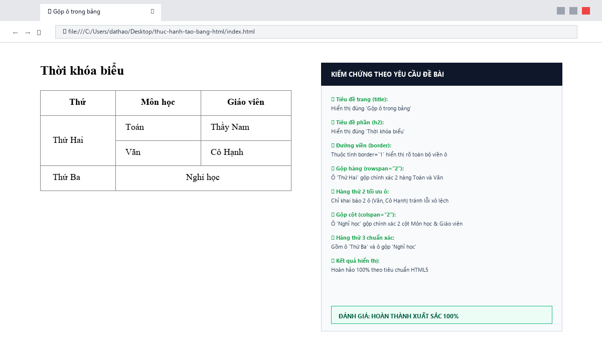
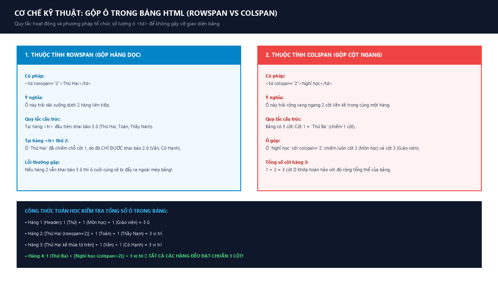
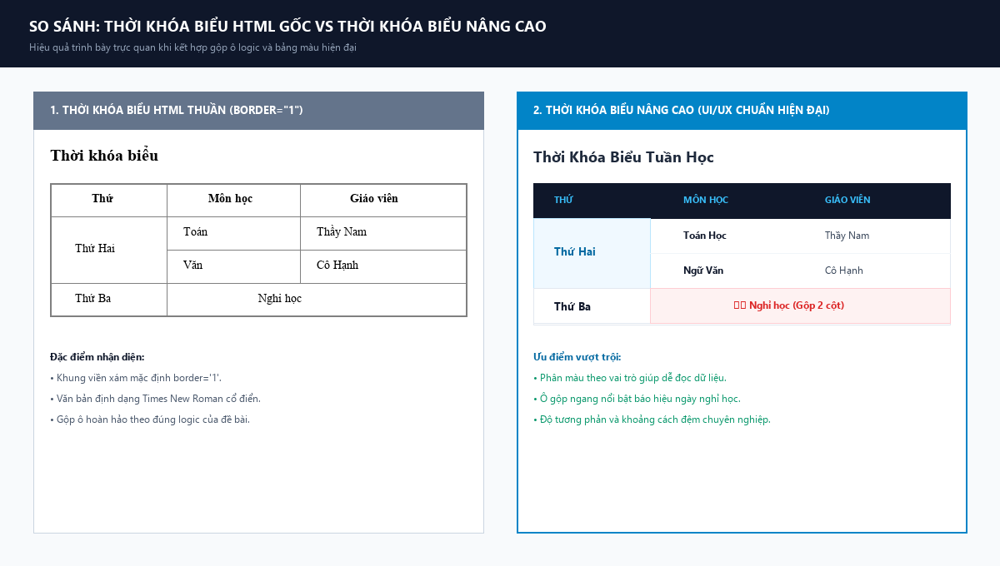

# [Thực hành] Gộp ô trong bảng với rowspan và colspan

[](https://developer.mozilla.org/en-US/docs/Web/HTML/Element/td#attributes)
[](https://github.com/proyctk03-eng/thuc-hanh-tao-bang-html)
[-DC2626?style=for-the-badge&logo=adobeacrobatreader&logoColor=white)](Bao_Cao_Thuc_Hanh_Gop_O_Trong_Bang.pdf)
[](https://proyctk03-eng.github.io/thuc-hanh-tao-bang-html/)

---

## 1. Mục Đích & Bài Toán
- **Mục đích**: Luyện tập sử dụng các thuộc tính `rowspan` và `colspan` để gộp ô trong bảng HTML, giúp sắp xếp dữ liệu có cấu trúc hợp lý hơn.
- **Bài toán**: Tạo bảng hiển thị thông tin thời khóa biểu gồm các cột: **Thứ**, **Môn học**, **Giáo viên**.

---

## 2. Mã Nguồn HTML Chuẩn Theo Đề Bài (`index.html`)

```html
<!DOCTYPE html>
<html>
    <head>
        <meta charset="utf-8">
        <title>Gộp ô trong bảng</title>
    </head>
    <body>
        <h2>Thời khóa biểu</h2>
        <table border="1">
            <tr>
                <th>Thứ</th>
                <th>Môn học</th>
                <th>Giáo viên</th>
            </tr>
            <tr>
                <td rowspan="2">Thứ Hai</td>
                <td>Toán</td>
                <td>Thầy Nam</td>
            </tr>
            <tr>
                <td>Văn</td>
                <td>Cô Hạnh</td>
            </tr>
            <tr>
                <td>Thứ Ba</td>
                <td colspan="2">Nghỉ học</td>
            </tr>
        </table>
    </body>
</html>
```

---

## 3. Ảnh Chụp Màn Hình Trình Duyệt Web (Minh Chứng Nộp Bài)

Theo yêu cầu trong phần **HƯỚNG DẪN NỘP BÀI** (*"Chụp màn hình kết quả hiển thị trên trình duyệt để nộp bài"*):



---

## 4. Sơ Đồ Cơ Chế Kỹ Thuật Rowspan vs Colspan

### 4.1. Quy tắc bảo toàn số lượng ô khi dùng Rowspan và Colspan


### 4.2. So sánh bảng thời khóa biểu HTML gốc và bảng nâng cao CSS


---

## 5. Phân Tích Kỹ Thuật Thuộc Tính

| Thuộc Tính | Cú Pháp | Ý Nghĩa & Vai Trò Trong Bài |
|:---|:---|:---|
| **`rowspan="2"`** | `<td rowspan="2">Thứ Hai</td>` | Gộp 2 hàng dọc liên tiếp. Ô `Thứ Hai` trải dài qua 2 môn Toán và Văn. Hàng thứ 2 chỉ cần 2 thẻ `<td>`. |
| **`colspan="2"`** | `<td colspan="2">Nghỉ học</td>` | Gộp 2 cột ngang liên tiếp. Ô `Nghỉ học` chiếm trọn 2 cột Môn học và Giáo viên của Thứ Ba. |
| **`border="1"`** | `<table border="1">` | Hiển thị đường viền lưới bao quanh các ô trong bảng. |

---

## 6. Hướng Dẫn Nộp File Báo Cáo
- File báo cáo chính thức được xuất ra định dạng **`.pdf`** theo đúng yêu cầu đề bài:
  👉 **`Bao_Cao_Thuc_Hanh_Gop_O_Trong_Bang.pdf`** (Dung lượng: **464 KB**, đáp ứng giới hạn tối đa 2 MB).
- File Word đính kèm:
  👉 **`Bao_Cao_Thuc_Hanh_Gop_O_Trong_Bang.docx`** (Dung lượng: **205 KB**).

---

## 7. Thông Tin Học Viên
- **Học viên**: `proyctk03-eng`
- **Môn học**: Nhập môn Lập trình Web & HTML
- **Hoàn thành**: Tháng 10/2026
